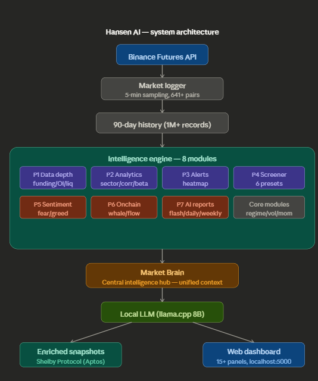

# Hansen AI Research Engine

> Sovereign market intelligence infrastructure for AI-driven crypto research.


Hansen AI is a sovereign, locally-operated market intelligence system designed to collect, analyze, and store crypto market data for AI-driven research and trading. The engine combines continuous market data collection, autonomous AI analysis, enriched dataset generation, and decentralized storage via Shelby Protocol.

**100% local. Zero cloud. Zero third-party AI APIs.** Only Binance Futures public data and Shelby Protocol for on-chain dataset storage.

## Demo

https://www.loom.com/share/00aaed5d8321454ca4f44f6c67973bf2


\---

## Key Features

* Fully local AI market intelligence engine — sovereign, no cloud
* 641+ Binance Futures pairs monitored in real-time
* 90-day rolling historical dataset (1M+ records)
* 8 interconnected intelligence modules feeding central AI brain
* Local LLM reasoning via llama.cpp (Llama 3.1 8B)
* Automated enriched dataset generation every \~4 hours
* On-chain verifiable dataset storage via Shelby Protocol
* Real-time web dashboard with 15+ panels
* AI-generated market reports (flash/daily/weekly)
* Automatic narrative detection (12 market narratives)
* Multi-chain crypto payments (BSC/ARB/ETH/SOL/BTC/Aptos)

\---

## Tech Stack

|Layer|Technology|
|-|-|
|Language|Python 3.14|
|Web Framework|Flask|
|LLM Inference|llama.cpp (localhost:8080)|
|Database|SQLite|
|Uploader|Node.js|
|Market Data|Binance Futures API (public)|
|Dataset Storage|Shelby Protocol (Aptos testnet)|
|Frontend|Vanilla HTML/CSS/JS, Font Awesome, Sora + JetBrains Mono|

\---

## Quick Start

**Clone repository:**

```bash
git clone https://github.com/yourname/hansen-ai
cd hansen-ai
```

**Create virtual environment:**

```bash
python -m venv venv
activate venv
pip install -r requirements.txt
```

**Run LLM server:**

```bash
cd C:\\AI\\llama
.\\llama-server.exe -m models/Meta-Llama-3.1-8B-Instruct-Q4\_K\_M.gguf --port 8080 --ctx-size 4096 --threads 8
```

**Start engine:**

```bash
activate C:\\AI\\hansen\_ai\\venv
cd C:\\AI\\hansen\_engine
python engine.py run
```

**Start dashboard:**

```bash
python -m dashboard.web\_dashboard
```

**Open browser:**

```
http://localhost:5000
```

**Optional — Ngrok (public access):**

```bash
ngrok http 5000
```

**Optional — Shelby uploader (WSL):**

```bash
cd /mnt/c/AI/shelby\_uploader
node uploader.js
```

\---

## Architecture Overview



```
Binance Futures API
        ↓
  Market Logger (5-min sampling, 641+ pairs)
        ↓
  Historical Dataset (90-day, 1M+ records)
        ↓
  ┌─────────────────────────────────────────────┐
  │       8 Intelligence Modules                 │
  │                                              │
  │  P1  Data Depth (funding/OI/liquidation)     │
  │  P2  Analytics (sectors/correlation/beta)    │
  │  P3  Alerts + Heatmap                        │
  │  P4  Smart Screener (6 presets)              │
  │  P5  Sentiment + Narrative (fear/greed)      │
  │  P6  Onchain Intel (whale/flow/stablecoin)   │
  │  P7  AI Reports (flash/daily/weekly)         │
  │  --  Core (regime/momentum/volatility)       │
  └─────────────────────────────────────────────┘
        ↓
  ┌─────────────────────────────────────────────┐
  │          Market Brain                        │
  │   Central Intelligence Hub                   │
  │   8 data sources → unified AI context        │
  └─────────────────────────────────────────────┘
        ↓
  Local LLM (llama.cpp, Llama 3.1 8B)
        ↓
  ┌──────────────┬──────────────────────────┐
  │  Enriched    │  Web Dashboard           │
  │  Snapshots   │  15+ real-time panels    │
  │      ↓       │  AI Insight panel        │
  │  Shelby      │  Scrollytelling landing  │
  │  Protocol    │  Admin panel             │
  └──────────────┴──────────────────────────┘
```

\---

## Intelligence Modules

### P1 — Data Depth

* **Funding Rate**: Real-time rates with long/short sentiment scoring
* **Open Interest**: OI spike and dump detection
* **Liquidation Feed**: Cascade monitoring with dominance analysis
* **Derivatives Collector**: Unified background data collection

### P2 — Analytics

* **Sector Performance**: 110+ coins across 16 sectors. Multi-timeframe ranking (1h/4h/24h/7d), rotation detection, strength scoring
* **Correlation Matrix**: 25-coin Pearson correlation (pure Python, no numpy). Multi-window (24h/7d/14d/30d)
* **Beta vs BTC**: Per-coin beta relative to Bitcoin

### P3 — Alerts + Heatmap

* **Alert Engine**: Price pump/dump, funding spikes, liquidation surges, volume anomalies. Severity levels, cooldown, persistent history
* **Market Heatmap**: Sector-grouped color grid with intensity based on price change

### P4 — Smart Screener

6 preset filters: Momentum Kings, Dip Buys, Volume Surge, Low Funding, High Funding, Breakout Candidates. Custom filter support with real-time scanning.

### P5 — Sentiment + Narrative

* **Fear \& Greed Index**: 4-component composite (momentum 40%, volatility 20%, volume 20%, breadth 20%)
* **12 Narratives**: Alt Season, BTC Dominance, Meme Mania, DeFi Revival, AI Narrative, L2 Pump, Market Fear, Capitulation, Accumulation, Gaming Surge, RWA Momentum, High Funding Warning

### P6 — Onchain Intelligence

* **Whale Activity**: Volume spike detection on 20 major coins, accumulation/distribution scoring
* **Exchange Flow**: Buy/sell pressure from OHLC, net inflow/outflow
* **Stablecoin Flow**: USDC/FDUSD/DAI/TUSD tracking, peg monitoring

### P7 — AI Reports

* **Flash**: 3-5 sentence market snapshot
* **Daily**: 5-section structured report
* **Weekly**: Forward-looking analysis
* Local LLM generates from Market Brain context. Fallback template when offline.

### Market Brain

Central hub aggregating all 8 data sources into unified reasoning context. Powers AI reports, snapshot enrichment, and the `/api/v1/brain/context` endpoint.

\---

## Web Dashboard

### Dashboard Panels

|Panel|Description|
|-|-|
|Market Regime|Bull/Bear/Sideways per coin|
|Volatility Index|Market-wide volatility level|
|System Stats|Records, symbols, snapshot ETA, uploads|
|Top Gainers/Losers|Real-time price movers|
|Market Summary|BTC/ETH/BNB/SOL overview|
|Derivatives Intelligence|Funding, OI, Liquidations|
|Sector Performance|16-sector ranking + rotation|
|Correlation Matrix|25-coin heatmap + beta vs BTC|
|Alert Center|Severity-based alert feed|
|Market Heatmap|Visual sector color grid|
|Smart Screener|6-preset coin scanner|
|Market Sentiment|Fear/Greed + active narratives|
|Onchain Intelligence|Whale, flow, stablecoin|
|AI Reports|Flash/daily/weekly + LLM status|
|AI Market Insight|Latest LLM-generated analysis|

### Landing Page

Professional scrollytelling design with 3D rotating logo, parallax scroll, glassmorphism, Font Awesome icons, live sector ticker, and multi-chain payment modal.

### Admin Panel

User management, payment tracking, audit log, role-based access (Viewer/Analyst/Admin).

\---

## API Endpoints

|Method|Endpoint|Description|
|-|-|-|
|GET|`/api/v1/movers`|Top movers|
|GET|`/api/v1/system`|System statistics|
|GET|`/api/v1/derivatives`|Funding, OI, liquidations|
|GET|`/api/v1/sector-performance`|Sector summary + rotation|
|GET|`/api/v1/sector-ranking?tf=24h`|Ranking by timeframe|
|GET|`/api/v1/correlation?window=7d`|Correlation + beta|
|GET|`/api/v1/alerts`|Alerts + stats|
|GET|`/api/v1/heatmap?tf=24h`|Market heatmap|
|GET|`/api/v1/screener`|All screener presets|
|GET|`/api/v1/sentiment`|Fear/Greed + narratives|
|GET|`/api/v1/onchain`|Whale, flow, stablecoin|
|GET|`/api/v1/reports`|Report summary|
|GET|`/api/v1/reports/generate?type=daily`|Generate report|
|GET|`/api/v1/brain`|Brain summary|
|GET|`/api/v1/brain/context`|Full AI context|
|GET|`/api/v1/ai-insight`|Latest AI analysis|

\---

## Enriched Snapshot Structure

Each snapshot uploaded to Shelby contains the full market intelligence context:

```json
{
  "records": \["...30,000 price records..."],
  "market\_regime": {"regime": "sideways", "breakdown": {}},
  "volatility": {"index": 0.32, "level": "medium"},
  "market\_insight": \["BTC holds relative momentum..."],
  "top\_gainers": \[{"symbol": "PLAY", "change\_pct": 6.97}],
  "top\_losers": \[{"symbol": "LYN", "change\_pct": -7.89}],
  "sector\_performance": {
    "ranking": \["...16 sectors ranked..."],
    "top\_3": \["AI / Compute", "Infrastructure", "Meme"]
  },
  "sector\_rotation": {"rotating\_in": \[], "rotating\_out": \[]},
  "sentiment": {"score": 41.9, "level": "Cautious", "components": {}},
  "active\_narratives": \[
    {"label": "Accumulation Phase", "strength": 93.3},
    {"label": "AI Narrative Hot", "strength": 10.9}
  ],
  "alerts\_summary": {"stats": {"last\_24h": 643, "critical\_24h": 263}},
  "whale\_activity": {"total\_signals": 6},
  "exchange\_flow": {"net\_sentiment": "neutral"},
  "opportunities": {
    "momentum\_kings": \[],
    "dip\_buys": \[],
    "breakout\_candidates": \[]
  },
  "correlation": {"strongest\_pairs": \[], "high\_beta": \[]},
  "derivatives": {
    "funding\_summary": {},
    "oi\_summary": {},
    "liq\_summary": {},
    "cascade\_alert": {}
  },
  "brain\_data\_sources": 8,
  "generated\_at": "2026-03-13T08:30:00"
}
```

\---

## Module Structure

```
hansen\_engine/
├── engine.py                        # Core engine + Market Brain + market logger
├── config.py                        # System configuration
│
├── modules/                         # 30+ intelligence modules
│   ├── market\_data.py               # Binance API (prices, ticker, klines)
│   ├── market\_brain.py              # Central AI reasoning hub
│   ├── sector\_performance.py        # 16-sector analysis (110+ coins)
│   ├── correlation\_matrix.py        # 25-coin correlation + beta
│   ├── alert\_engine.py              # Multi-type alert system
│   ├── market\_heatmap.py            # Sector heatmap generator
│   ├── smart\_screener.py            # 6-preset screener
│   ├── sentiment\_engine.py          # Fear/Greed + narratives
│   ├── onchain\_intel.py             # Whale, flow, stablecoin
│   ├── ai\_reports.py                # LLM report generator
│   ├── derivatives\_collector.py     # Funding, OI, liquidation
│   ├── market\_regime.py             # Regime detection
│   ├── momentum\_engine.py           # Momentum ranking
│   ├── volatility\_index.py          # Volatility index
│   ├── top\_movers.py                # Top movers detection
│   ├── market\_intelligence.py       # Legacy sector analysis
│   ├── funding\_rate.py              # Funding tracker
│   ├── open\_interest.py             # OI history
│   ├── liquidation\_feed.py          # Liquidation monitor
│   └── ...                          # + 15 more utility modules
│
├── dashboard/                       # Web + CLI dashboards
│   ├── web\_dashboard.py             # Flask dashboard (15+ panels)
│   ├── landing\_page.py              # Scrollytelling landing page
│   ├── dashboard\_config.py          # Configuration
│   ├── db\_manager.py                # SQLite user DB
│   ├── email\_service.py             # Gmail SMTP
│   ├── payment\_detector.py          # Multi-chain payments
│   └── ...                          # + CLI dashboards
│
├── agents/                          # Autonomous agents
├── pipeline/                        # Training + research pipelines
├── core/                            # Logger, profile, insight
├── router/                          # Intent routing
├── rag/                             # Retrieval-augmented generation
├── data/                            # Runtime data + AI reports
└── dataset/                         # Snapshot lifecycle
    ├── pending/                     # Awaiting upload
    ├── uploaded/                    # Successfully uploaded
    ├── failed/                      # Failed uploads
    ├── processed/                   # Processed for training
    └── training/                    # Training-ready datasets
```

\---

## CLI Usage

```bash
python engine.py run          # Start engine

# Market
dashboard                     # Full market dashboard
market                        # Market leaders
insight                       # AI market insight
regime                        # Market regime
volindex                      # Volatility index
price btc                     # BTC price

# System
health                        # System health
dataset                       # Dataset statistics
monitor                       # Monitoring report

# Agents
agent "analyze market trend"  # Run agent task
enrich                        # Enrich snapshots
train                         # Training pipeline
research "topic"              # Research topic
```

\---

## Roadmap

* \[ ] AI Trade Signals — confluence scoring from all modules + structure detection
* \[ ] Multi-exchange support (Bybit, OKX)
* \[ ] Advanced regime detection with ML
* \[ ] Reinforcement learning trading agent
* \[ ] Public dataset explorer
* \[ ] Shelby mainnet dataset publishing
* \[ ] Telegram bot + webhook alerts (P8)
* \[ ] API monetization layer

\---

## Dataset Storage

Hansen AI uses [Shelby Protocol](https://explorer.shelby.xyz) as the decentralized storage layer for enriched market datasets. Shelby enables verifiable, permissionless dataset storage on Aptos — making Hansen AI datasets accessible for AI training pipelines with on-chain provenance.

\---

## System Requirements

* Python 3.14+
* Node.js (Shelby uploader)
* llama.cpp server at `http://127.0.0.1:8080`
* WSL with Shelby CLI (dataset upload)
* Binance Futures API access (public, no key required)

\---

## License

Proprietary. All rights reserved.

