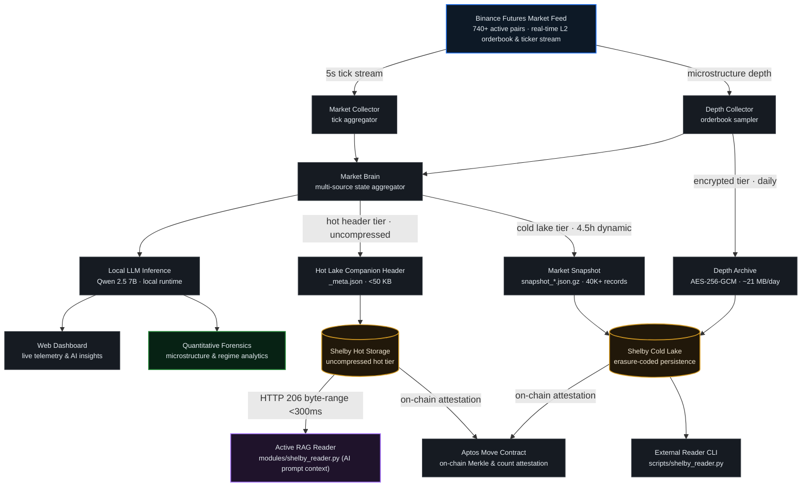

# Hansen AI Research Engine

<p align="center">
  
</p>

<p align="center">
  <a href="https://x.com/M0neyHeistHunt">
    
  </a>
</p>

<p align="center">
  
  
  
  
  
  
</p>

---

> **Sovereign market intelligence infrastructure for AI-driven crypto research.**

Hansen AI is a sovereign, locally-operated market intelligence system designed to collect, analyze, and store crypto market data for AI-driven research and trading.

The engine combines:
- Continuous market data collection  
- Autonomous AI analysis  
- Enriched dataset generation  
- Decentralized storage via Shelby Protocol  

**Local-first AI architecture. Zero mandatory cloud.**  
Powered by local LLMs with optional Groq API fallback for high-availability. Only relies on Binance Futures public data and Shelby Protocol.

---

## 🎥 Demo

https://youtu.be/YyaH22LkkEA

---

## Key Features

* Fully local AI market intelligence engine — sovereign, no cloud
* 740+ Binance Futures pairs monitored in real-time (741 active cluster)
* 90-day rolling historical dataset (1M+ records)
* 10 interconnected intelligence sources feeding central AI brain
* Local LLM reasoning via llama.cpp (Qwen 2.5 7B) with Groq Cloud failover
* Automated enriched dataset generation every ~4.5 hours (40,000+ records dynamic window)
* Verifiable decentralized lake storage via Shelby Protocol (Hot & Cold tiers)
* Real-time web dashboard with 15+ panels
* AI-generated market reports (flash/daily/weekly)
* Automatic narrative detection (12 market narratives)
* Multi-chain crypto payments (BSC/ARB/ETH/SOL/BTC/Aptos)

---

## Tech Stack

|Layer|Technology|
|---|---|
|Language|Python 3.14|
|Web Framework|Flask|
|LLM Inference|llama.cpp (local) + Groq Cloud failover|
|Database|SQLite|
|Uploader|Node.js / TypeScript (`@shelby-protocol/sdk@0.9.2` + `@aptos-labs/ts-sdk`)|
|Market Data|Binance Futures API (public websocket + REST)|
|Dataset Storage|Shelby Protocol (shelbynet)|
|Attestation|Aptos Move Smart Contract (`hansen::registry`)|
|Frontend|Vanilla HTML/CSS/JS, Font Awesome, Sora + JetBrains Mono|

---

## Quick Start

**Clone repository:**

```bash
# Clone the repository
git clone https://github.com/Assassinprotocol/hansen-ai-research-engine.git
cd hansen-ai-research-engine
```

**Create virtual environment:**

```bash
python -m venv venv
source venv/bin/activate
pip install -r requirements.txt
```

**Run LLM server:**

```bash
cd ~/AI/llama.cpp
./build/bin/llama-server -m models/Qwen2.5-7B-Instruct-Q4_K_M.gguf --port 8080 --ctx-size 4096 --threads 6
```

**Start engine:**

```bash
source venv/bin/activate
python engine.py run
```

**Start dashboard:**

```bash
source venv/bin/activate
python -m dashboard.web_dashboard
# Browser: http://localhost:5000
```

**Optional — Shelby publisher daemon:**

```bash
cd ./shelby_uploader
npm install
npm run build && npm start
# Or for direct development execution:
# npm run dev
```

---

## Architecture Overview


```mermaid
graph TD
    %% TIER 1: INGESTION
    FEED["Binance Futures Market Feed<br/>740+ active pairs · real-time L2 orderbook & ticker stream"]

    %% TIER 2: PARALLEL AGGREGATION
    FEED -->|5s tick stream| TICK["Market Collector<br/>tick aggregator"]
    FEED -->|microstructure depth| DEPTH["Depth Collector<br/>orderbook sampler"]

    %% TIER 3: INTELLIGENCE CORE
    TICK --> BRAIN["Market Brain<br/>multi-source state aggregator"]
    DEPTH --> BRAIN
    BRAIN --> LLM["Local LLM Inference<br/>Qwen 2.5 7B · local runtime"]

    %% TIER 4: OUTPUT & FORENSIC SPLIT
    LLM --> DASH["Web Dashboard<br/>live telemetry & AI insights"]
    LLM --> FORENSIC["Quantitative Forensics<br/>microstructure & regime analytics"]
    BRAIN -->|hot header tier · uncompressed| META["Hot Lake Companion Header<br/>_meta.json · <50 KB"]
    BRAIN -->|cold lake tier · 4.5h dynamic| SNAP["Market Snapshot<br/>snapshot_*.json.gz · 40K+ records"]
    DEPTH -->|encrypted tier · daily| ARCH["Depth Archive<br/>AES-256-GCM · ~21 MB/day"]

    %% TIER 5: DECENTRALIZED PERSISTENCE (SHELBY PROTOCOL)
    META --> SHELBY_HOT[("Shelby Hot Storage<br/>uncompressed hot tier")]
    SNAP --> SHELBY_COLD[("Shelby Cold Lake<br/>erasure-coded persistence")]
    ARCH --> SHELBY_COLD

    %% TIER 6: CONSUMPTION & PROOF
    SHELBY_HOT -->|HTTP 206 byte-range <300ms| RAG["Active RAG Reader<br/>modules/shelby_reader.py (AI prompt context)"]
    SHELBY_COLD --> CLI["External Reader CLI<br/>scripts/shelby_reader.py"]
    SHELBY_HOT -->|on-chain attestation| APTOS["Aptos Move Contract<br/>on-chain Merkle & count attestation"]
    SHELBY_COLD -->|on-chain attestation| APTOS

    classDef default font-family:sans-serif,font-size:12px;
    classDef nodeBase fill:#161b22,stroke:#30363d,color:#e6edf3,stroke-width:1px;
    classDef nodeFeed fill:#0d1926,stroke:#1f6feb,color:#e6edf3,stroke-width:1.5px;
    classDef nodeForensic fill:#072214,stroke:#238636,color:#e6edf3,stroke-width:1.5px;
    classDef nodeShelby fill:#21180a,stroke:#d29922,color:#f0e6d2,stroke-width:1.5px;
    classDef nodeRag fill:#1f132b,stroke:#a371f7,color:#e6edf3,stroke-width:1.5px;

    class FEED nodeFeed;
    class TICK,DEPTH,BRAIN,LLM,DASH,META,SNAP,ARCH,CLI,APTOS nodeBase;
    class FORENSIC nodeForensic;
    class SHELBY_HOT,SHELBY_COLD nodeShelby;
    class RAG nodeRag;
```

---

## Intelligence Modules

### P1 — Data Depth

* **Funding Rate**: Real-time rates with long/short sentiment scoring
* **Open Interest**: OI spike and dump detection
* **Liquidation Feed**: Cascade monitoring with dominance analysis
* **Derivatives Collector**: Unified background data collection

### P2 — Analytics

* **Sector Performance**: 110+ coins across 16 sectors. Multi-timeframe ranking (1h/4h/24h/7d), rotation detection, strength scoring
* **Correlation Matrix**: 25-coin Pearson correlation (pure Python, no numpy). Multi-window (24h/7d/14d/30d)
* **Beta vs BTC**: Per-coin beta relative to Bitcoin

### P3 — Alerts + Heatmap

* **Alert Engine**: Price pump/dump, funding spikes, liquidation surges, volume anomalies. Severity levels, cooldown, persistent history
* **Market Heatmap**: Sector-grouped color grid with intensity based on price change

### P4 — Smart Screener

6 preset filters: Momentum Kings, Dip Buys, Volume Surge, Low Funding, High Funding, Breakout Candidates. Custom filter support with real-time scanning.

### P5 — Sentiment + Narrative

* **Fear & Greed Index**: 4-component composite (momentum 40%, volatility 20%, volume 20%, breadth 20%)
* **12 Narratives**: Alt Season, BTC Dominance, Meme Mania, DeFi Revival, AI Narrative, L2 Pump, Market Fear, Capitulation, Accumulation, Gaming Surge, RWA Momentum, High Funding Warning

### P6 — Onchain Intelligence

* **Whale Activity**: Volume spike detection on 20 major coins, accumulation/distribution scoring
* **Exchange Flow**: Buy/sell pressure from OHLC, net inflow/outflow
* **Stablecoin Flow**: USDC/FDUSD/DAI/TUSD tracking, peg monitoring

### P7 — AI Reports

* **Flash**: 3-5 sentence market snapshot
* **Daily**: 5-section structured report
* **Weekly**: Forward-looking analysis
* Local LLM generates from Market Brain context. Fallback template when offline.

### Market Brain

Central hub aggregating 10 data sources (`adv_regime`, `sector_performance`, `sentiment`, `alerts`, `whale_activity`, `screener`, `derivatives`, `correlation`, `mtf_confluence`, `breadth_div`) into a unified reasoning context. Powers AI reports, snapshot enrichment, and the `/api/v1/brain/context` endpoint.

---

## Web Dashboard

### Dashboard Panels

|Panel|Description|
|---|---|
|Market Regime|Bull/Bear/Sideways per coin|
|Volatility Index|Market-wide volatility level|
|System Stats|Records, symbols, snapshot ETA, uploads|
|Top Gainers/Losers|Real-time price movers|
|Market Summary|BTC/ETH/BNB/SOL overview|
|Derivatives Intelligence|Funding, OI, Liquidations|
|Sector Performance|16-sector ranking + rotation|
|Correlation Matrix|25-coin heatmap + beta vs BTC|
|Alert Center|Severity-based alert feed|
|Market Heatmap|Visual sector color grid|
|Smart Screener|6-preset coin scanner|
|Market Sentiment|Fear/Greed + active narratives|
|Onchain Intelligence|Whale, flow, stablecoin|
|AI Reports|Flash/daily/weekly + LLM status|
|AI Market Insight|Latest LLM-generated analysis|

### Landing Page

Professional scrollytelling design with 3D rotating logo, parallax scroll, glassmorphism, Font Awesome icons, live sector ticker, and multi-chain payment modal.

### Admin Panel

User management, payment tracking, audit log, role-based access (Viewer/Analyst/Admin).

---

## API Endpoints

|Method|Endpoint|Description|
|---|---|---|
|GET|`/api/v1/movers`|Top movers|
|GET|`/api/v1/system`|System statistics|
|GET|`/api/v1/derivatives`|Funding, OI, liquidations|
|GET|`/api/v1/sector-performance`|Sector summary + rotation|
|GET|`/api/v1/sector-ranking?tf=24h`|Ranking by timeframe|
|GET|`/api/v1/correlation?window=7d`|Correlation + beta|
|GET|`/api/v1/alerts`|Alerts + stats|
|GET|`/api/v1/heatmap?tf=24h`|Market heatmap|
|GET|`/api/v1/screener`|All screener presets|
|GET|`/api/v1/sentiment`|Fear/Greed + narratives|
|GET|`/api/v1/onchain`|Whale, flow, stablecoin|
|GET|`/api/v1/reports`|Report summary|
|GET|`/api/v1/reports/generate?type=daily`|Generate report|
|GET|`/api/v1/brain`|Brain summary|
|GET|`/api/v1/brain/context`|Full AI context|
|GET|`/api/v1/ai-insight`|Latest AI analysis|

---

## Enriched Snapshot Structure

Each snapshot uploaded to Shelby contains the full market intelligence context:

```json
{
  "lake_header": {
    "market_phase": "CHOP",
    "energy_level": "LOW",
    "liquidity_magnet": "Liquidation density is concentrated in a tight band immediately surrounding spot price, with long-dominant liquidations acting as the primary downside magnet if the range breaks.",
    "systemic_risk": "NORMAL",
    "positioning_imbalance": "Positioning z-scores are flat with neutral funding (0.0017) and no OI spikes, indicating a lack of directional conviction.",
    "forensic_narrative": "Microstructure telemetry reveals a high-strength range regime with zero directional signal agreement and neutral funding rates."
  },
  "records": ["...40,000+ price records across 740+ pairs (dynamic 4.5h window)..."],
  "market_regime": {"regime": "sideways", "breakdown": {}},
  "volatility": {"index": 0.32, "level": "medium"},
  "market_insight": ["BTC holds relative momentum..."],
  "top_gainers": [{"symbol": "PLAY", "change_pct": 6.97}],
  "top_losers": [{"symbol": "LYN", "change_pct": -7.89}],
  "sector_performance": {
    "ranking": ["...16 sectors ranked..."],
    "top_3": ["AI / Compute", "Infrastructure", "Meme"]
  },
  "sector_rotation": {"rotating_in": [], "rotating_out": []},
  "sentiment": {"score": 38.2, "level": "Cautious", "components": {}},
  "active_narratives": [
    {"label": "Accumulation Phase", "strength": 93.3}
  ],
  "alerts_summary": {"stats": {"last_24h": 643, "critical_24h": 263}},
  "whale_activity": {"total_signals": 6},
  "exchange_flow": {"net_sentiment": "neutral"},
  "opportunities": {
    "momentum_kings": [],
    "dip_buys": [],
    "breakout_candidates": []
  },
  "correlation": {"strongest_pairs": [], "high_beta": []},
  "derivatives": {
    "funding_summary": {},
    "oi_summary": {},
    "liq_summary": {}
  },
  "brain_total_sources": 10,
  "generated_at": "2026-10-09T16:58:40"
}
```

---

## Module Structure

```
hansen_engine/
├── engine.py                        # Core engine + Market Brain + market logger
├── config.py                        # System configuration
│
├── modules/                         # 50+ intelligence & infrastructure modules
│   ├── market_data.py               # Binance API (prices, ticker, klines)
│   ├── market_brain.py              # Central AI reasoning hub (10 data sources)
│   ├── sector_performance.py        # 16-sector analysis (110+ coins)
│   ├── correlation_matrix.py        # 25-coin correlation + beta
│   ├── alert_engine.py              # Multi-type alert system
│   ├── market_heatmap.py            # Sector heatmap generator
│   ├── smart_screener.py            # 6-preset screener
│   ├── sentiment_engine.py          # Fear/Greed + 12 narratives
│   ├── derivatives_collector.py     # Funding rates, OI, liquidation feeds
│   ├── market_regime.py             # Advanced regime detector
│   ├── mtf_confluence.py            # Multi-timeframe confluence scorer
│   ├── momentum_engine.py           # Momentum ranking & velocity
│   ├── depth_collector.py           # Orderbook depth sampler
│   ├── binance_guard.py             # Anti-ban adaptive rate limiter
│   ├── ai_reports.py                # LLM report generator (Flash/Daily/Weekly)
│   └── ...                          # + 35 more factor & utility modules
│
├── dashboard/                       # Web & CLI telemetry
│   ├── web_dashboard.py             # Flask dashboard (15+ panels)
│   ├── landing_page.py              # Scrollytelling landing page
│   ├── dashboard_config.py          # Configuration
│   ├── db_manager.py                # SQLite user DB
│   ├── email_service.py             # Gmail SMTP
│   └── payment_detector.py          # Multi-chain crypto payments
│
├── contract/                        # On-chain attestation
│   ├── Move.toml                    # Aptos package manifest
│   └── sources/registry.move        # hansen::registry smart contract
│
├── shelby_uploader/                 # Decentralized uploader daemon
│   ├── src/uploader.ts              # TypeScript uploader daemon
│   ├── src/network.ts               # Dynamic multi-network resolver
│   └── src/crypto.ts                # AES-256-GCM authenticated encryption
│
├── scripts/                         # Downstream tooling & verification
│   ├── shelby_reader.py             # Consumer query CLI (range/verify/decrypt/onchain)
│   └── benchmark_sla.py             # Empirical TTFB & availability probe
│
├── agents/                          # Autonomous agent stubs
├── core/                            # Engine core, logger, profile, memory
├── router/                          # Intent routing
├── rag/                             # Retrieval-augmented generation
└── dataset/                         # Snapshot lifecycle
    ├── pending/                     # Awaiting upload
    ├── uploaded/                    # Successfully uploaded
    └── failed/                      # Failed uploads (auto-recovery)
```

---

## CLI Usage

```bash
python engine.py run          # Start engine

# Market
dashboard                     # Full market dashboard
market                        # Market leaders
insight                       # AI market insight
regime                        # Market regime
volindex                      # Volatility index
price btc                     # BTC price

# System
health                        # System health
dataset                       # Dataset statistics
monitor                       # Monitoring report

# Agents
agent "analyze market trend"  # Run agent task
enrich                        # Enrich snapshots
train                         # Training pipeline
research "topic"              # Research topic
```

---

## Roadmap

* [x] AI Trade Signals
* [x] Advanced regime detection
* [x] Multi-timeframe analysis (15m / 1h / 4h)
* [x] High-frequency depth collection
* [/] Multi-exchange support (partial)
* [ ] Next.js dashboard frontend
* [ ] Public dataset explorer
* [ ] Shelby mainnet dataset publishing
* [ ] Discord bot + webhook alerts (P8)
* [ ] API monetization layer

---

## Decentralized Data Lake (Shelby Protocol)

Hansen AI uses [Shelby Protocol](https://shelby.xyz) as its decentralized storage layer for verifiable market intelligence data. Detailed technical specifications:
* 📄 [System Architecture Specification](docs/architecture.md)
* 📄 [Shelby Protocol Integration Guide](docs/shelby_integration.md)

**Decentralized Lake Storage Architecture:**
- **Hot Storage Tier:** Uncompressed `_meta.json` companion header blobs (<50 KB) uploaded to Shelby Hot Storage, providing zero-decompression sub-second HTTP 206 byte-range slicing (<300ms) for live Active RAG inferences.
- **Cold Lake Tier:** Enriched market snapshots (40,000+ records across 740+ pairs via dynamic 4.5h window, compressed with native Gzip to ~730 KB `.json.gz`, 85.6% storage reduction) published cyclically.
- **Encrypted Tier:** High-frequency depth archives (~21 MB/day) encrypted client-side using **AES-256-GCM** before decentralized placement.
- **Active RAG Client:** Sub-second range reader (`modules/shelby_reader.py`) fetching hot lake headers directly from Shelby storage nodes for AI prompt augmentation with local fallback.
- **Multi-Network Architecture:** Dynamic 1-switch network toggle (`ACTIVE_NETWORK=shelbynet | private_mainnet | testnet | localnet`) powered by `@shelby-protocol/sdk@0.9.2`.
- **Gas Safety Guard:** Automated signer balance floor (0.2 APT) and 5,000 Octas hard ceiling on Aptos Move attestation calls.
- **On-Chain Proof:** Permanent attestation via Aptos Move smart contract (`contract/sources/registry.move`), notarizing Merkle roots and exact record counts.
- **Downstream Tooling:** Reader CLI (`scripts/shelby_reader.py`) supporting inspection, transparent `.gz` decompression, byte-range queries, authenticated AES decryption, and on-chain ledger attestation (`onchain`).
- **Empirical SLA:** Verified 100% Availability and sub-second TTFB latency (<300ms for hot slices, ~811 ms for cold blobs).

The background TypeScript uploader automatically publishes datasets to the `hansen_ai/market_pipeline/` namespace on the active Shelby network.

---

## System Requirements

* Python 3.14+
* Node.js (Shelby uploader daemon)
* llama.cpp server at `http://127.0.0.1:8080`
* Binance Futures API access (public, no key required)

---

## License

Proprietary. All rights reserved.
